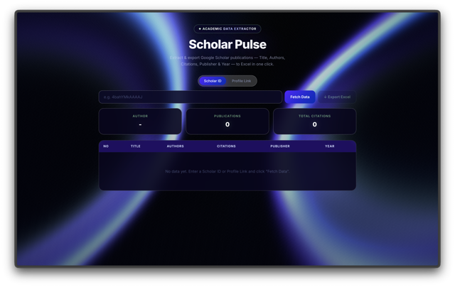

<div align="center">



<h1>✦ Scholar Pulse ✦</h1>

**Rapidly extract, analyze, and export Google Scholar publication data without the fuss.**

<br/>

[](https://react.dev)
[](https://vitejs.dev)
[](https://expressjs.com)
[](https://threejs.org)
[](./LICENSE)

[](https://vercel.com/new/clone?repository-url=https%3A%2F%2Fgithub.com%2Fyour-username%2Fscholar-pulse&env=SERPAPI_KEY)

</div>

---

<div align="center">
  <h3>⚡ Fetch → View → Export — in seconds.</h3>
  <p>Paste a Google Scholar ID or profile link and get a full publication list with citation counts, instantly exported to Excel.</p>
</div>

---

## ✨ Features

| Feature | Description |
|---------|-------------|
| 🔍 **Dual Input Mode** | Enter a raw Scholar ID or paste a full profile URL |
| 📊 **Publication Table** | Title · Authors · Citations · Publisher · Year |
| 📈 **Live Stats Cards** | Author name, total publications & total citations |
| 📥 **One-click Excel Export** | Download all results as a `.xlsx` file |
| 🌊 **WebGL Background** | Interactive ColorBends shader that reacts to your mouse |
| ✦ **Spotlight Cards** | Hover effects with radial glow that follows the cursor |
| 🔤 **Animated Hero** | BlurText word-by-word reveal & ShinyText badge animation |
| ⏳ **Loading Overlay** | Full-screen blur overlay with spinner while fetching |
| ⚡ **Zero Database** | Fully stateless — fetches live data on every request |

---

## 🎨 UI Highlights

- **ColorBends** — WebGL shader background (Three.js) with mouse parallax
- **SpotlightCard** — Cards with a glowing radial spotlight that tracks the cursor
- **BlurText** — Word-by-word blur-in animation for the hero title
- **ShinyText** — Sweeping gradient shine animation on the badge
- **Glassmorphism** — Frosted glass cards with `backdrop-filter` blur

---

## 🚀 Getting Started

### Prerequisites

- **Node.js** 18+
- **npm** 9+

### Install & Run

```bash
# 1. Clone the repository
git clone https://github.com/fiqgant/scholar-pulse.git
cd scholar-pulse

# 2. Install dependencies
npm install

# 3. Setup Environment Variables
# Create a .env file in the root directory and add your SerpAPI key
echo "SERPAPI_KEY=your_api_key_here" > .env

# 4. Start development (frontend + API concurrently)
npm run dev
```

| Service | URL |
|---------|-----|
| 🌐 Frontend | http://localhost:5173 |
| ⚙️ API | http://localhost:8787 |

---

## 🧭 How to Use

1. Open **http://localhost:5173** in your browser
2. Choose your input mode — **Scholar ID** or **Profile Link**
3. Enter the Scholar ID (e.g. `4bahYMkAAAAJ`) or paste the full URL
4. Click **Fetch Data** — a full-screen loading overlay appears while fetching
5. Browse the results in the table
6. Click **↓ Export Excel** to save everything as `.xlsx`

---

## ☁️ Deploy to Vercel

Scholar Pulse is pre-configured to automatically deploy as a full-stack app on Vercel. 
The React frontend is built as static files, and the Express backend runs natively as **Vercel Serverless Functions** (`/api/*`).

1. Push your code to GitHub.
2. Sign in to [Vercel](https://vercel.com/) and create a **New Project**.
3. Import your `scholar-pulse` repository.
4. **Important**: In the *Environment Variables* section, add:
   - Name: `SERPAPI_KEY`
   - Value: `your_actual_serpapi_key`
5. Click **Deploy**.

*(Optionally, assign your custom domain `scholarpulse.vercel.app` in the Vercel project settings).*

---

## 🔌 API Reference

| Method | Endpoint | Description |
|--------|----------|-------------|
| `GET` | `/health` | Health check — returns `{ ok: true }` |
| `GET` | `/api/publications?userId=<ID>&limit=<N>` | Fetch publications (max 500) |

**Example request:**

```bash
curl "http://localhost:8787/api/publications?userId=4bahYMkAAAAJ&limit=10"
```

**Example response:**

```json
{
  "author": {
    "id": "4bahYMkAAAAJ",
    "name": "Albert Einstein",
    "affiliation": "Princeton University"
  },
  "total": 10,
  "publications": [
    {
      "no": 1,
      "title": "On the Electrodynamics of Moving Bodies",
      "author": "A Einstein",
      "totalDikutip": 9823,
      "publishe": "Annalen der Physik",
      "tahun": "1905"
    }
  ]
}
```

---

## 🛠️ Tech Stack

| Layer | Technology |
|-------|------------|
| **Frontend** | React 19, Vite 7 |
| **Styling** | Vanilla CSS, Glassmorphism |
| **3D / Animation** | Three.js, Framer Motion |
| **UI Components** | [React Bits](https://reactbits.dev) |
| **Backend** | Express 5, Node.js |
| **Scholar Data API** | [SerpAPI](https://serpapi.com/) `google_scholar_author` |
| **Export** | xlsx |
| **Dev Tooling** | ESLint, concurrently |

---

## ⚠️ Known Limitations

> **SerpAPI Free Tier Limits**
>
> Scholar Pulse uses SerpAPI to reliably fetch Google Scholar data without IP bans. The free tier of SerpAPI provides **100 searches per month**.
> If you encounter:
> ```
> SerpAPI returned 403 or Failed to fetch data.
> ```
> It means you have exhausted your API credits or your `SERPAPI_KEY` is missing/invalid check your `.env` file.

---

## 📁 Project Structure

```
scholar-pulse/
├── server/
│   └── index.js          # Express API (SerpAPI integration)
├── src/
│   ├── components/
│   │   ├── BlurText.jsx   # Word-by-word blur animation
│   │   ├── ColorBends.jsx # WebGL shader background
│   │   ├── ShinyText.jsx  # Shiny sweep text effect
│   │   └── SpotlightCard.jsx # Mouse-tracking glow card
│   ├── App.jsx            # Main application
│   ├── App.css            # All component styles
│   └── index.css          # Global reset & font
├── public/
├── package.json
├── vercel.json           # Vercel Configuration
└── vite.config.js
```

---

## 📄 License

MIT © 2026 — Made with ☕ and Three.js
